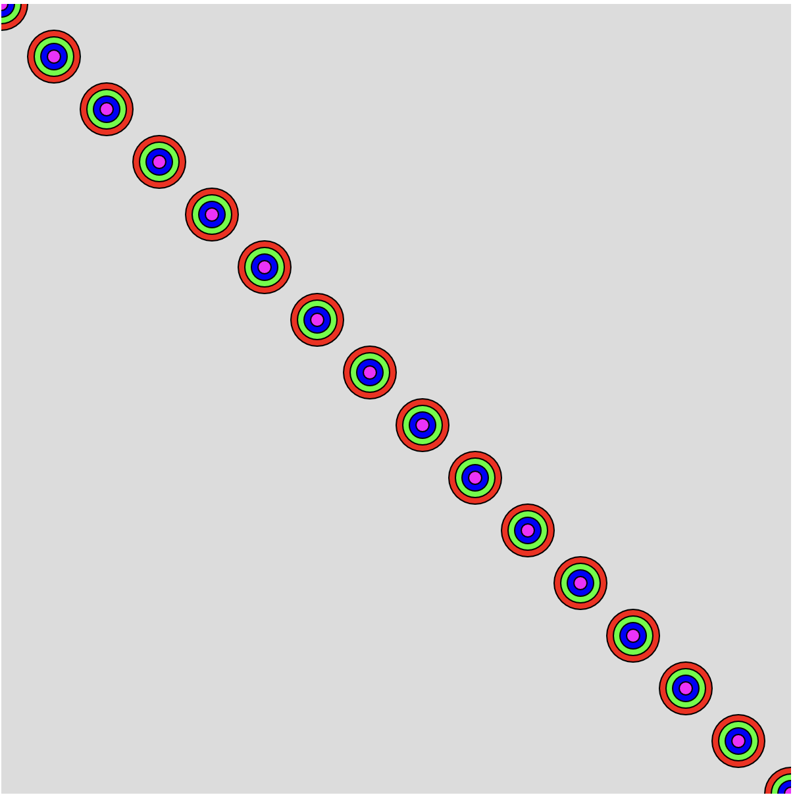
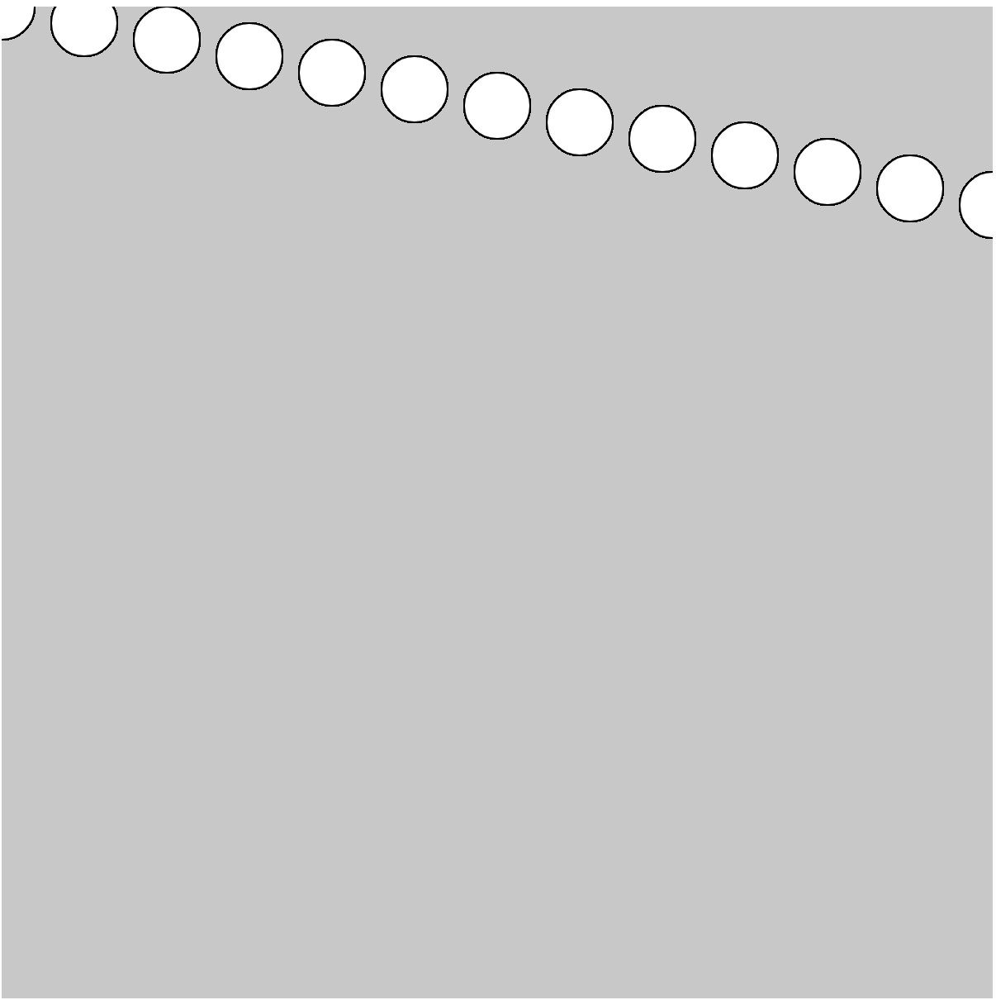
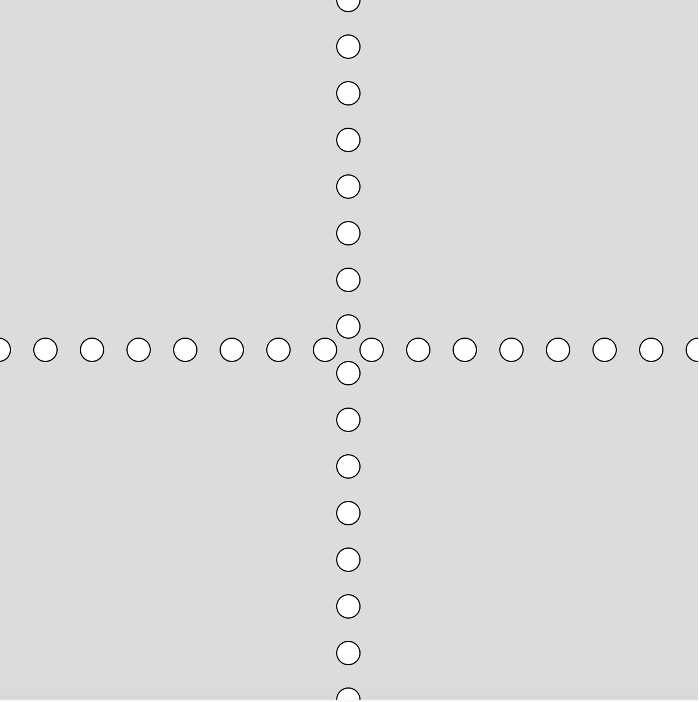
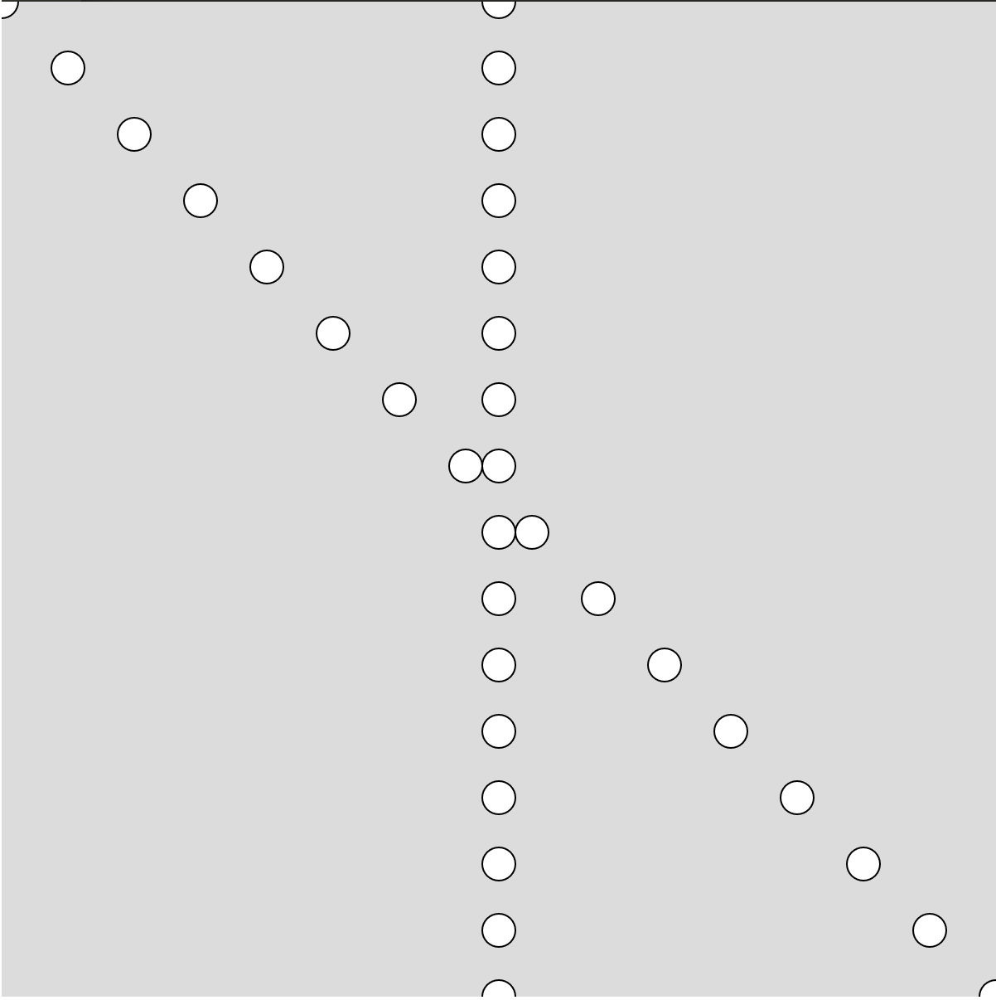
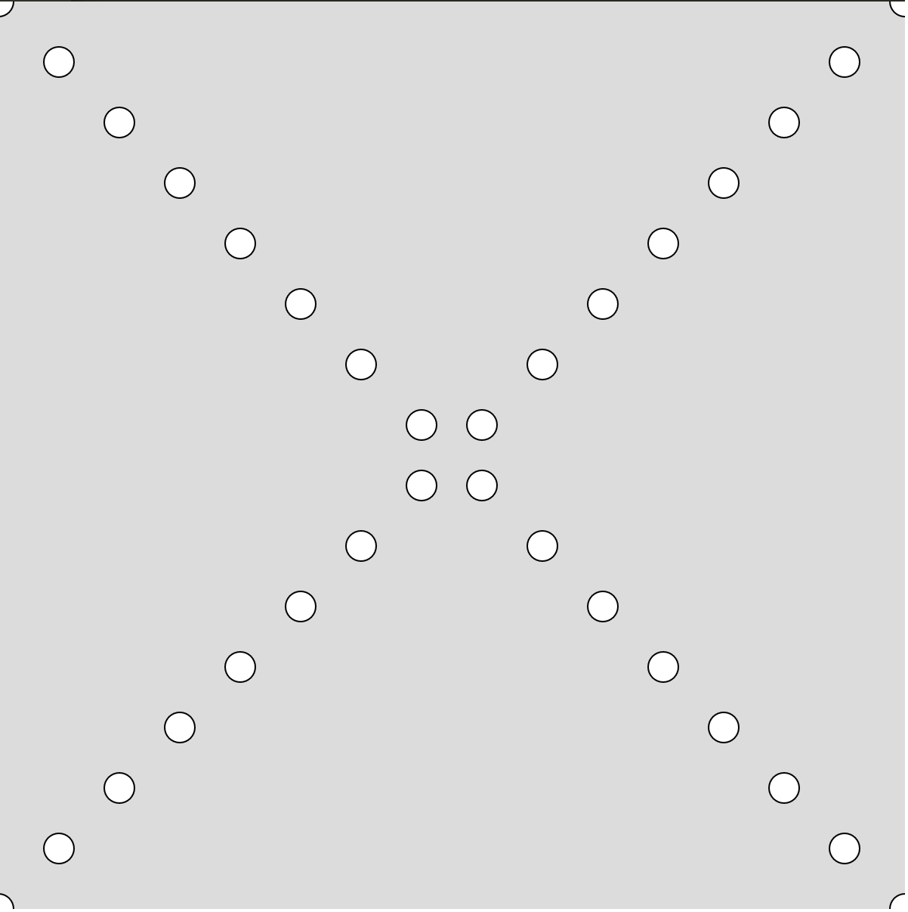
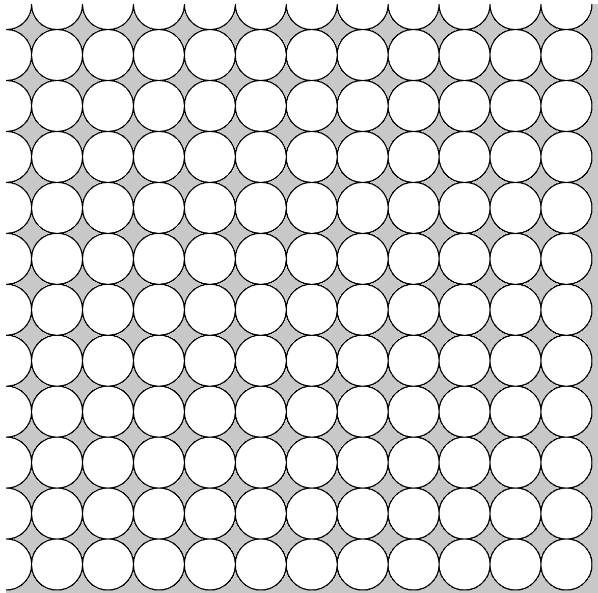
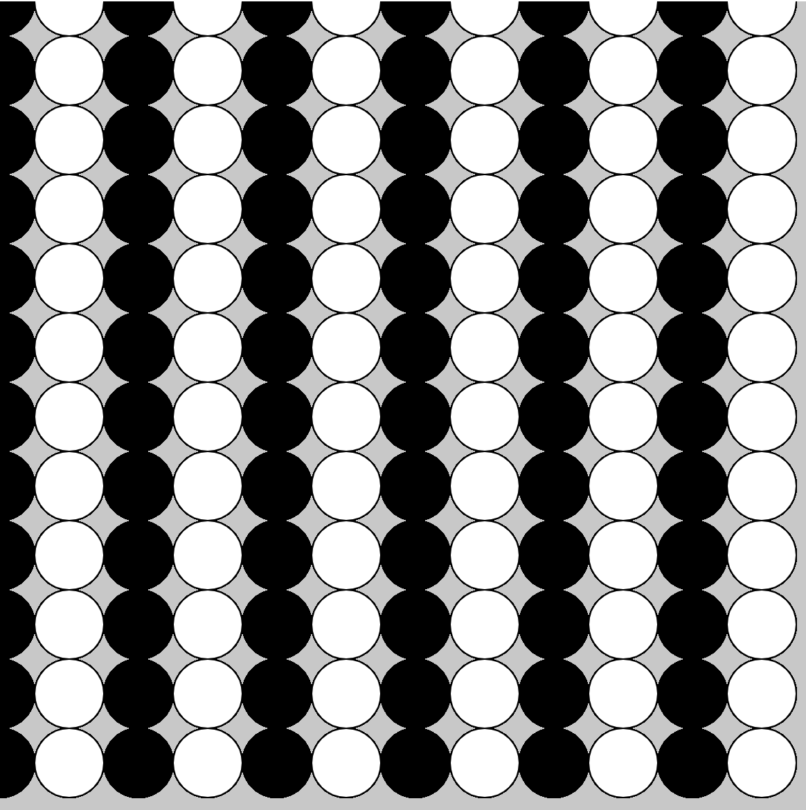
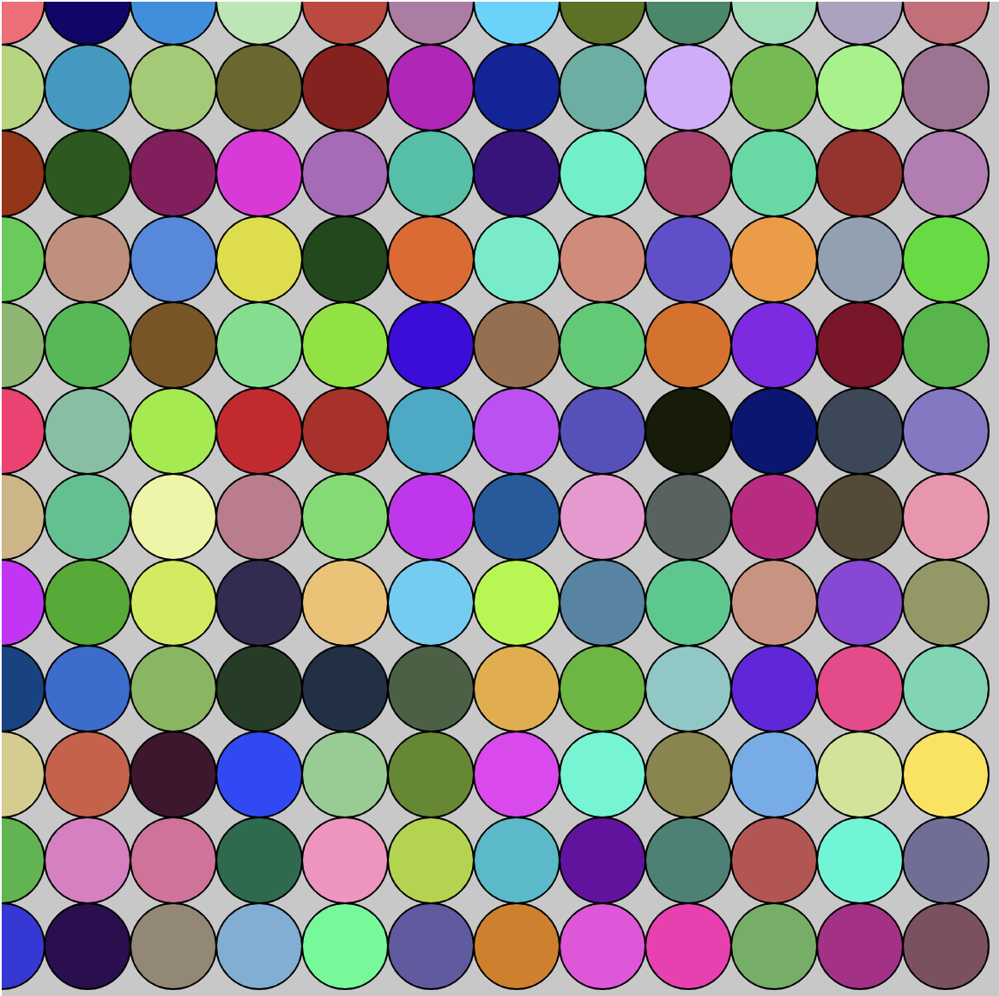

# For Loops Part 2
Today we will be continuing our examinination of for loops. Last class we discussed the basic structure of a for loop and how we could use this to draw iteratively in our programs.

For example, the loop shown below would draw cricles that are 100 pixels apart for the entire width of the page. 

```javascript
for(var x = 0; x < width; x += 100){
	ellipse(x, 100, 50, 50)
}
```

## Tasks
Today we will be creating more complex drawings using `for` loops. 

**WARM-UP**: Create the image shown below using a for loop. It should:
 - Start at the top of the page and stop at the bottom of the page
 - Repeat the same drawing every 100 pixels.


1. Refactor your code from the warm up in order to create the drawing shown below. You should have targets drawn from the upper left corner to the lower right corner.



2. Create a drawing that increments the x value by 5 times the amount of the y value. For example, if the y coodinate is 10, then the x coordinate would be 50.



3. Use a for loop to draw two lines of circles:
 - One set of circles should go from left to right
 - One set of circle should go from the top of the page to the bottom.



4. Use a for loop to draw two lines of circles:
 - One set of circle should go from the top of the page to the bottom.
 - One set of circles should form a diagonal from the upper left corner to the lower right corner



5. Use a for loop to draw two lines of circles:
 - One set of circles should form a diagonal from the upper right corner to the lower left corner
 - One set of circles should form a diagonal from the upper left corner to the lower right corner



6. Use for loop to create a page filled with a shape of your choice. For example, the image below has rows of white circles that were created using for loops.



7. Add color to the drawing you created in problem 6. Have each row or column be its own distinct color. For example, the circle drawing for loop was updated to be columns of black and white.



8. Make the color a random color every time a circle is drawn. This should result in circle being generated that are all a different RGB color.



9. **STRETCH**: Try to put a conditional in your for loop (this can be a new one or any of the others you've written) so that all the shapes in a given row turn a color when the mouse is on the left side of the screen, and turn back when it's no longer there.